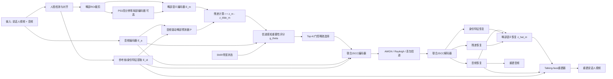

# 面向低带宽视频会议的面部关键区域感知音视频语义通信与自适应重建方法研究调研报告

## 执行摘要

这条研究方向**可做、能毕业、工程上可落地**，但原始题目“面向低带宽视频会议的面部关键区域感知音视频语义通信与自适应重建方法研究”仍然偏宽，当前更像“搭建一条完整系统链路”，而不是一个容易在硕士开题和答辩中讲清楚的**具体方法问题**。近五年的相关工作已经分别在 DeepJSCC、无线视频语义传输、多模态语义通信、音频驱动 talking-face、关键点/3DMM 语义传输、生成式重建与信道自适应这几个方向取得了可直接复用的成果：DeepJSCC 系列证明了端到端联合源信道编码在低 SNR、低带宽下较传统分离式方案更稳健；DeepWiVe、DVST、SwinJSCC、MambaJSCC 等工作把 JSCC 从图像扩展到视频并引入了带宽/信道自适应；Wav2Vid 和 SyncSC 已经把“视频会议/说话人视频”作为明确场景，开始利用音频—嘴型相关性减少视觉传输；Wav2Lip、SadTalker、LatentSync 等开源模型则让接收端生成式重建在工程上变得现实。citeturn0academia12turn3academia12turn16academia49turn21academia34turn16academia47turn8academia48turn3academia13turn10academia47turn18academia40turn22search11

基于这些现状，**最适合硕士毕业**的题目不应再把“关键区域感知、自适应重建”笼统地全部当作创新，而应收缩成一个模块级创新：**音频预测残差 + 信道感知稀疏传输**。也就是说，发送端不再完整传所有嘴部视觉语义，而是先利用音频预测“基础嘴型/口部运动”，仅对**音频无法准确预测**的嘴部残差语义进行 Top-K 稀疏传输，并根据信道状态动态调整传输量；接收端再结合音频、参考人脸和残差，完成 talking-face 重建。这一创新点比“做一个大系统”更像一篇合格的硕士论文方法创新，同时仍然能挂接你关心的“面部关键区域”“多模态语义通信”“自适应重建”三个关键词。citeturn8academia48turn3academia13turn11academia43turn11academia44

就 PS3 而言，你此前上传的材料已经体现出想把 PS3 与语义通信结合的思路。fileciteturn0file0 但需要修正的是，NVIDIA 官方 PS3 是**高分辨率视觉编码器/预训练方法**，不是一个现成的语义通信系统；它擅长“低分辨率全局 + 选择性高分辨率局部”的视觉编码，适合被放在**嘴部 ROI 或面部局部高分辨率特征提取器**的位置，作为可选增强模块或对比模块，而**不应**成为整个论文的主线依赖。更务实的策略是：主方案先用轻量 mouth ROI encoder 或 AV-HuBERT / 3DMM 语义表示跑通；PS3 仅作为“高分辨率嘴部局部编码”的增强实验。如果 PS3 收益不明显，论文仍然完整。citeturn4search0turn17search0turn17search3turn11search0

综合文献成熟度、开源可用性、算力需求和答辩可解释性，我推荐的精确题目是：

**《面向低带宽视频会议的音频预测残差驱动嘴部语义稀疏传输与自适应重建方法研究》**

这是比原题更适合硕士毕业的版本：场景仍然是视频会议；主对象仍然是人脸关键区域；通信属性体现在“低带宽、信道感知、稀疏传输、JSCC”；生成重建属性体现在“自适应重建”；核心创新则被收缩为一个足够具体、可写公式、可做消融、可复现的方法模块。citeturn3academia12turn8academia48turn21academia36turn20academia38

## 研究背景与现实需求

这个课题的现实需求并不抽象。现有视频会议平台在高清模式下仍然高度依赖上行带宽：Zoom 的官方文档给出的建议值显示，1:1 720p 视频通话大约需要 **1.2 Mbps** 上下行带宽，1080p 则需要 **3.8/3.0 Mbps** 级别的上下行带宽；群组通话对带宽的要求更高，而且系统会根据网络状况自动下调画质。换句话说，只要场景切到移动网络、边缘弱网、校园/宿舍共享网络、车载/无人机回传、远程医疗等环境，传统“尽量保全部像素”的视频编码思路就会很快碰到上行和实时性的瓶颈。citeturn23search0turn23search5turn23search6

现实需求也不只来自办公会议。美国 HHS 的患者指南明确指出，多数 telehealth 场景需要具备视频与声音能力的联网设备，而连接不足仍然是普遍障碍；一些医疗行业资料进一步指出，实时视频问诊、护理机构和基层诊所的 broadband 需求会迅速提高。对于这些场景而言，“让用户看清医生/患者面部表情和口型、听清关键语音内容”常常比“忠实还原背景细节”更重要。也就是说，**人类通信的任务目标本身**就天然支持“语义优先”的传输策略。citeturn24search1turn24search2

从通信系统角度看，这正是语义通信的适用场景。DeepJSCC 这类方法的核心优势不是理论上“取代所有视频编解码器”，而是在低时延、低带宽、信道起伏和失配条件下，相比 JPEG/JPEG2000/BPG/H.264/H.265 加信道编码的传统分离式链路，更容易表现出**平滑退化**而不是“悬崖效应”。图像上的这一结论已经由早期 DeepJSCC 奠定，视频上的这一趋势则在 DeepWiVe 与 DVST 等工作中被进一步验证。citeturn0academia12turn21academia36turn16academia49

因此，这个课题最合适的工程定位不是“做通用视频语义通信”，而是针对一个更窄、但更真实的应用：**低带宽视频会议中的说话人视频传输**。在这个场景里，大量信息天然是冗余的：背景通常静止或变化很小，说话人的身份在短时间内基本不变，面部全局姿态变化有限，而**语音内容、嘴部运动、局部表情**才是决定“信息是否传对”的关键。Wav2Vid 就是沿着这个现实假设出发，将音频与短时视频结合起来，在接收端生成说话人视频，并报告了最高约 **83%** 的视频会议数据量削减。citeturn2academia43turn8academia48

## 近五年国内外相关工作综述

### DeepJSCC 与无线视频语义传输

近五年相关工作的底座仍然是 DeepJSCC。2018 年的原始 DeepJSCC 证明了图像可直接映射到复数信道符号，在 AWGN 与慢衰落条件下相较传统分离式方案表现出更好的低 SNR 性能和更平滑的失配退化。进入近五年之后，研究重点逐渐转向**速率自适应、信道自适应、视频扩展与轻量化**。Yang 与 Kim 在 2021 年提出了单模型多码率的自适应速率控制 DeepJSCC，并公开了代码；DeepWiVe 则把 JSCC 推向视频，并引入 RL 做帧间带宽分配；DVST 进一步利用时序先验与条件编码结构，把视频内容感知和带宽自适应融合在一起；SwinJSCC 和 MambaJSCC 把 backbone 从 CNN 升级为 Swin Transformer 与状态空间模型，同时显式利用 CSI 做信道适配，在效率与鲁棒性上继续前进。citeturn20academia38turn21academia36turn16academia49turn21academia34turn15academia45turn16academia47

对你的选题来说，这条线的价值不在于“必须追最新 backbone”，而在于已经给出了可以直接复用的**通信底座**：如果论文需要一个可重复的、像通信论文的主干，那么用现成 SwinJSCC / Dynamic_JSCC / MambaJSCC 的编码思想来承接 visual 或 residual token 的信道传输，是比从零设计 JSCC 更稳妥的路线。citeturn20search1turn20search7turn15academia45

### 多模态语义通信

多模态语义通信在 2022—2026 年的进展表明，音频和视觉不应被简单地看成两条并行码流。音视频的联合建模在语音识别、嘴型理解和鲁棒通信里都更有效。AV-HuBERT 与后续 AVSR 工作已经充分证明：视觉口型信息能显著提升噪声下的语音识别鲁棒性；在 LRS3 上，AVSR 相对纯音频识别有明显优势，特别是在强噪声下。与此同时，2024 年的 SyncSC 直接以面部视频和语音传输为例，将 3DMM 系数和文本作为多模态语义，并在分组丢包网络上研究同步和分组级 FEC；同年的 Wav2Vid 则把视频会议场景中的“音频驱动生成”与选择性视频传输结合起来。citeturn11academia43turn11academia44turn3academia13turn2academia43

这些工作给出的启示很明确：你的论文没有必要把“多模态”做成泛泛的音频+视频+文本三模态大一统，而应把对象锁定到**语音 + 嘴部/面部视觉语义**，必要时再把文本作为辅助训练监督或可选模态。这样既能保留“多模态”标签，又能把工程难度控制在硕士可承受范围内。citeturn3academia13turn2academia43turn11academia43

### 音频驱动 talking-face 与生成式重建

如果没有接收端生成式重建，这个课题几乎做不轻。Wav2Lip 证明了仅凭目标音频就能把任意身份视频的唇形重新对齐，并提供了广泛使用的 lip-sync 训练代码、预训练模型和评测工具；SadTalker 进一步把 3DMM 的头部姿态与表情系数显式建模，使“单图 + 音频 → 说话人视频”的质量明显提升；2025 年前后的 LatentSync 则把 lip-sync 提升到扩散模型路线，并显著改善了时序一致性和高分辨率表现。citeturn10academia47turn18search0turn18academia40turn22search11turn18search1

这意味着硕士论文完全没有必要自己从零训练一个生成式 talking-face 大模型。更实际的做法是：**发送端创新、接收端尽量复用成熟生成器**。把研究工作量集中到“应该传什么、传多少、何时传”的通信问题上，而不是把大量时间花在生成模型本身的重训练上。citeturn18search0turn4search3turn22search11

### 关键点/ROI 传输与生成式视频恢复

和你的题目最接近的一类工作，是“只传运动或局部语义，再在接收端生成人脸视频”。First Order Motion Model 提供了关键点驱动图像动画的经典开源基线；SyncSC 选择传 3DMM 系数和文本，重点解决跨模态同步与丢包鲁棒性；Wav2Vid 则更进一步，选择性传输短时视频片段，在接收端由音频驱动恢复剩余视频。citeturn9search0turn3academia13turn8academia48

但这些工作也恰恰暴露出你这篇论文可以切入的空白：**现有方法通常做“传完整关键点/3DMM/短视频片段”或“做宏观级选择”，但很少显式建模音频已经能够解释的那部分嘴部信息与仍需额外传输的残差信息之间的边界。**这就为“音频预测残差 + 稀疏传输”留下了很好的切入点。citeturn3academia13turn2academia43turn11academia43

### 生成式重建与信道自适应资源分配

从视频语义通信角度，DeepWiVe、DVST、Wav2Vid、SyncSC 和近两年的生成式视频语义通信工作都已经说明：**生成式重建**与**自适应资源分配**是两个必备方向。DeepWiVe 用 RL 做帧间带宽分配；DVST 做内容感知与码率自适应；Dynamic_JSCC、SwinJSCC 与 MambaJSCC 则把“单模型多信道、多码率适应”做成了通用能力。近期的一些生成式视频语义通信工作还开始直接把 keyframe、文本描述和结构条件作为传输语义，在接收端用扩散模型重建视频。citeturn21academia36turn16academia49turn20academia38turn21academia34turn16academia47turn2academia46turn2academia45

不过，站在“硕士毕业即可”的目标下，最稳妥的策略不是再加一个强化学习资源调度器，而是采用**可微、端到端、轻量的门控/Top-K 稀疏选择**。这类方法更容易训练，更容易解释，也更容易在答辩时说明“具体改了哪里”。citeturn20academia38turn21academia36

### PS3 在该方向中的真实位置

PS3 值得保留，但要“降级使用”。NVIDIA 官方 PS3 是面向 4K 分辨率视觉预训练的编码器，核心思想是：在低分辨率全局编码的基础上，选择性处理高分辨率局部区域，从而在近似恒定开销下获得更强的高分辨率局部感知能力；官方代码、权重和 Hugging Face 模型卡都把它定位为**视觉特征提取器**而不是通信系统。模型卡还显示，PS3 的部分 4K 版本权重达到 **1B 参数量级**，并带有研究用途和非商业研究许可限制。citeturn4search0turn17search3turn17search0

因此，在你的课题里，PS3 最合理的位置是：**高分辨率嘴部 ROI 编码器 / 局部 patch 选择器 / 重要性评分器**。如果你最终采用关键点或 3DMM 作为主语义表示，PS3 可以完全不作为主线，只做一个“高分辨率局部视觉增强”的补充实验；如果你有余力做 patch-level 视觉残差传输，那么可用 PS3 替代普通 ViT/CNN 编码器，专门提取嘴部和眼周的高分辨率局部表征。这样既满足了你对 PS3 的兴趣，也不会把整篇论文绑死在一个复杂大模型上。citeturn4search0turn17search0turn17search3

## 现状分析与空白点

把现有工作横向比较后，可以看到一个很清楚的事实：**系统链路已经基本齐备，真正还缺的是“跨模态冗余显式建模”这一层。** DeepJSCC 解决了“如何过信道”；Wav2Lip / SadTalker / LatentSync 解决了“如何生成说话人视频”；Wav2Vid / SyncSC 解决了“如何在视频会议场景下传更少的信息”；但大多数方法仍停留在“传关键点、传 3DMM、传参考片段、传短时视频”这些粗粒度语义上，对“音频已经解释了多少嘴部运动”缺少显式建模。citeturn21academia36turn8academia48turn3academia13turn10academia47turn18academia40turn22search11

第二个空白点是：**关键区域还不够“细”。** 现有工作往往把“嘴部是 ROI”当作结论，但在嘴部内部，仍然存在大量随发音规律可由音频推断的基础运动，以及少量音频难以确定、却对视觉自然度和同步性非常重要的细节。例如唇闭合程度、齿露出、嘴角形变、局部表情等，并不都需要被同等对待。这个细粒度问题，正是最适合硕士论文切入的地方。citeturn11academia43turn11academia44turn10academia47

第三个空白点是：**许多自适应方法过于“重”，不适合毕业导向。** DeepWiVe 与部分最新工作使用 RL 做动态带宽分配是合理的研究路线，但 RL 训练复杂、环境搭建重、调参时间长，不太适合“只求可实现、可答辩”的硕士课题。相对而言，基于 Gumbel-Softmax、Top-K、可学习门控的稀疏选择方法，既能表达“信道感知 + 资源分配”，又更适合复现与消融。citeturn21academia36turn20academia38

第四个空白点与 PS3 直接相关：**高分辨率视觉编码能力与低带宽 talking-face 通信之间，还没有形成成熟的标准方案。** PS3 展示了高分辨率局部编码的潜力，但当前 talking-face 语义通信文献还没有把 PS3 类视觉编码器系统性嵌入“音频—嘴部残差—信道稀疏传输—生成式重建”链路中。这个位置更适合作为你的“可选增强模块”，而不是主创新点。citeturn4search0turn17search0turn17search3turn8academia48

基于以上四点，最可行的硕士方案不是继续扩大成“面部关键区域感知 + 全链路自适应 + 生成式重建 + PS3 全量参与”的大系统，而是在一个较稳的主链路上，加一个足够清楚的小创新：**音频预测嘴部基础语义，只传残差，并根据信道状态做稀疏控制。** 这会明显提升选题的“论文感”。citeturn8academia48turn3academia13turn20academia38

## 推荐题目与核心可行方案

### 推荐的精确题目

**《面向低带宽视频会议的音频预测残差驱动嘴部语义稀疏传输与自适应重建方法研究》**

这个题目比原题更适合硕士毕业，有三个原因。第一，它保留了你最关心的场景——低带宽视频会议。第二，它把“面部关键区域”收缩到了最适合通信建模的对象——嘴部语义。第三，它把创新点写成了一个**具体机制**，而不是宽泛目标：不是泛泛而谈“关键区域感知与自适应重建”，而是明确指出“音频预测残差驱动”和“稀疏传输”。这使得开题答辩时更容易回答“你具体改了哪个模块”。citeturn8academia48turn3academia13turn11academia43

### 备选题目

如果你希望弱化“嘴部”这种过于具体的表达，可以使用：

- **《面向低带宽视频会议的音频辅助面部关键语义稀疏传输与重建方法研究》**
- **《面向低带宽无线链路的说话人视频跨模态冗余抑制与自适应重建方法研究》**

这两个备选题目都能兼容后续实现细节的变化，例如从嘴部关键点改成 3DMM 参数，或从 ROI latent 改成 patch token，而不至于影响论文主线。citeturn3academia13turn2academia43turn11academia43

### 明确的核心创新点

推荐将核心创新点定义为：

> **提出一种音频预测残差驱动的嘴部语义稀疏传输方法：发送端首先利用音频语义和说话人身份信息预测基础嘴部运动，仅对真实嘴部语义与音频预测结果之间的残差进行重要性评分，并结合当前信道状态进行 Top-K 稀疏传输；接收端再将接收残差与音频预测结果融合，用于说话人视频重建。**

这个创新点是**模块级创新**，不是“拼系统”。它主要改动的是：**视觉语义编码器与 JSCC 编码器之间**的一段逻辑。它并不要求你重新发明音频编码器、生成模型和 JSCC 全结构，而是把创新集中到“该传什么”上。citeturn8academia48turn3academia13turn20academia38

形式化地，可以把它写成下面这一组核心公式：

\[
z_a = E_a(a), \qquad z_{id} = E_{id}(v_{ref}), \qquad z_m = E_m(v_{mouth})
\]

其中 \(a\) 是音频，\(v_{ref}\) 是参考人脸或关键帧，\(v_{mouth}\) 是嘴部 ROI，\(E_a,E_{id},E_m\) 分别是音频、身份与嘴部语义编码器。接着，用音频和身份去预测基础嘴部语义：

\[
\tilde z_m = P(z_a, z_{id})
\]

然后计算真实嘴部语义与可预测嘴部语义之间的残差：

\[
r_m = z_m - \tilde z_m
\]

对残差中的每个 token 或每一帧嘴部参数，构造一个信道感知的重要性评分函数：

\[
s_i = g_\theta(r_i, z_a, \gamma, B)
\]

其中 \(\gamma\) 表示当前 SNR，\(B\) 表示可用带宽预算。再按 Top-K 或可微门控得到稀疏掩码：

\[
m_i = \mathbf{1}\{i \in \operatorname{TopK}(s)\}
\]

最终发送的不是完整 \(z_m\)，而是：

\[
x = \operatorname{JSCCEnc}\big(z_a,\; z_{id},\; m \odot r_m\big)
\]

接收端先解码获得 \(\hat z_a,\hat z_{id},\hat r_m\)，然后恢复嘴部语义：

\[
\hat z_m = P(\hat z_a, \hat z_{id}) + \hat r_m
\]

再将 \(\hat z_m\)、\(\hat z_a\) 与参考人脸送入 Wav2Lip / SadTalker / FOMM 类 talking-face 重建器生成最终视频。这个公式链条非常适合放进开题报告与论文第三章。它直接体现了你“改的地方”——不是整条链路，而是**音频到嘴部的预测残差建模 + 信道感知稀疏传输**。citeturn10academia47turn18academia40turn9search0turn20academia38

### 完整系统架构图

下图给出一个适合硕士实现的完整系统主线。该图对应的是“主方案”，其中 PS3 只作为可选增强模块存在。该架构用到的各个子模块都能在现有开源实现中找到成熟起点，因此不会变成“从零造轮子”的高风险课题。citeturn20search1turn18search0turn4search3turn9search0turn17search3

### PS3 是否应纳入主方案

我的结论是：**可以纳入，但不建议成为主创新。**

如果你坚持把 PS3 放进论文，最合理的方式是把它写成一个**可插拔视觉增强模块**：

- 主方案：嘴部关键点 / 3DMM / 轻量 ROI latent  
- 可选增强：用 PS3 对高分辨率嘴部 ROI 做 patch-level 编码，再进入残差计算和稀疏传输

这么做的好处是，一旦 PS3 在你的数据集上收益有限，论文主干不会受影响。反过来，如果你把题目和主方法都绑定到 PS3，而最后实验发现它对 256×256 或 512×512 说话人视频没有明显优势，整篇论文会变得被动。PS3 的官方定位和 1B 级模型规模，也决定了它更像“增强组件”而不是“毕业论文主角”。citeturn4search0turn17search0turn17search3

## 实现细节与实验设计

### 可实施的模块划分

为了把工作量控制在硕士可完成的范围内，最合适的实现路线是“**一条完整链路 + 两个自己做的模块 + 若干开源骨干**”。推荐拆分如下表。

| 模块 | 推荐实现 | 是否自己重点实现 | 备注 |
|---|---|---:|---|
| 音频编码器 \(E_a\) | Mel 频谱 CNN / AV-HuBERT 音频分支 / Whisper embedding | 否 | 先用现成特征提取，减少训练压力。citeturn11search0turn22search11 |
| 身份特征编码器 \(E_{id}\) | 参考帧 CNN/ViT，或直接用 talking-face 自带 identity encoder | 否 | 保持稳定身份即可。citeturn18academia40turn9search0 |
| 嘴部语义编码器 \(E_m\) | 关键点、3DMM、嘴部 latent；PS3 作为可选高分辨率增强 | **是** | 主论文建议先做关键点/3DMM版本，PS3 作为增强实验。citeturn3academia13turn4search0turn17search0 |
| 音频驱动嘴部预测器 \(P\) | GRU / Transformer / MLP-Temporal | **是** | 论文核心模块之一。 |
| 信道感知稀疏选择器 \(g_\theta\) | Top-K / Gumbel-Softmax / 可学习门控 | **是** | 论文核心模块之二。citeturn20academia38 |
| JSCC 编码器 | Dynamic_JSCC / SwinJSCC / MambaJSCC 思路复用 | 部分 | 主干尽量复用开源实现和已有设计。citeturn20search1turn20search7turn16academia47 |
| Talking-face 重建器 | Wav2Lip / SadTalker / FOMM | 否 | 建议使用预训练模型，以系统集成为主。citeturn18search0turn4search3turn9search0 |

从毕业可行性角度，我更推荐先做**关键点/3DMM 版本**，原因是这会显著降低通信建模难度。SyncSC 已经证明，3DMM 系数和文本作为多模态语义在丢包网络上是可行的；SadTalker 也说明了 3DMM 运动系数在 talking-face 中非常实用。把嘴部语义先定义成关键点或 3DMM 参数，会使“残差”“Top-K”“信道自适应”全部变得更易训练、更好解释。citeturn3academia13turn18academia40

### 开源模型与代码起点

下面这些开源仓库足以拼出一条可运行的工程链路，而且多为官方实现或作者仓库。

| 用途 | 推荐仓库/模型 | 适合用途 |
|---|---|---|
| 自适应 DeepJSCC 基线 | `mingyuyng/dynamic_jscc` | 多码率、可微分速率控制，适合做信道感知门控对照。citeturn20search1turn20academia38 |
| Transformer JSCC 基线 | `semcomm/SwinJSCC` | 适合 image/ROI 级视觉语义传输。citeturn20search7turn21academia34 |
| talking-face 重建 | `Rudrabha/Wav2Lip` | lip-sync 强、代码成熟、训练和评测工具齐全。citeturn18search0turn10search0 |
| 3DMM talking-face 重建 | `OpenTalker/SadTalker` | 头姿态与表情更自然。citeturn4search3turn18academia40 |
| 关键点动画基线 | `AliaksandrSiarohin/first-order-model` | 关键点驱动视频生成。citeturn9search0turn9search2 |
| 音视频表征预训练 | `facebookresearch/av_hubert` | 提供多模态音频—视觉表征与预处理流程。citeturn11search0turn11academia43 |
| PS3 可选增强 | `NVlabs/PS3` / `nvidia/PS3-4K-SigLIP2` | 高分辨率局部嘴部特征增强。citeturn17search3turn17search0 |

为了遵守“毕业型”路线，建议不要把所有仓库都训一遍。最合理的做法是：**只训练你自己的两个模块**——音频预测器 \(P\) 与稀疏选择器 \(g_\theta\)；生成器和大部分主干尽量用预训练权重。citeturn18search0turn4search3turn11search0

### 训练与推理流程

主训练流程可以分成三步。第一步，做视觉语义定义：如果采用关键点/3DMM 方案，就从视频中离线提取嘴部关键点、2D/3D 人脸系数和参考帧；如果采用 latent/ROI 方案，就从嘴部裁剪图中提取视觉特征。第二步，训练音频驱动嘴部预测器 \(P\)，使其从音频和身份特征预测基础嘴部运动。第三步，在可微分信道层中，联合训练残差评分器和 JSCC 编码器，使系统在不同 SNR / 带宽预算下学会只传最必要的残差信息。接收端的视频重建尽量调用预训练 Wav2Lip / SadTalker，并通过同步和身份损失约束输出。这个训练流程与现有 JSCC 与 talking-face 开源实现是兼容的。citeturn20academia38turn18search0turn4search3

推理时的流程则更简单：输入参考帧、当前音频片段和少量视频帧，发送端先预测基础嘴型，再对残差进行信道感知稀疏选择，仅传音频、身份和稀疏残差；接收端组合这三类信息恢复说话人视频。这样的推理链路非常适合在论文中强调“轻发送端、重接收端”的工程价值。citeturn8academia48turn18academia40

### 数据集建议

为了满足“公开可下载、无需自建”的要求，同时兼顾 talking-face、AV speech 与 lip-sync 需要，最推荐的主数据集组合是：**VoxCeleb2 + LRS2 + GRID**，如果数据获取便利，可再加 LRW 做嘴部局部建模辅助。LRS3 当前不建议作为主训练集，因为官方页面显示视频下载已不再直接提供。citeturn14search5turn14search11turn7search1turn6search0turn5search0turn7search2

| 数据集 | 规模 | 下载与获取 | 许可/使用条件 | 预处理建议 |
|---|---|---|---|---|
| VoxCeleb1/2 | VoxCeleb 官方页给出总规模 **7000+** 说话人、**100万+** utterances、**2000+ 小时**；VoxCeleb2 开发集含 **5994** 人、**1,092,009** utterances。citeturn6search1turn14search5 | 官方 Oxford/VGG 页面；当前官方不再直接提供全部下载，但可通过研究用途申请获取，MMAI 页面仍提供研究下载入口说明。citeturn6search1turn14search5turn14search11 | 官方页面说明其 metadata 采用 **CC BY-SA 4.0**，MMAI 页面标注研究下载为 **CC BY 4.0** 研究用途。citeturn14search2turn14search5turn14search11 | 统一抽帧到 25 fps；做人脸检测、对齐、嘴部裁剪；保留参考帧和音频片段。可参照 AV-HuBERT 与 Wav2Lip 预处理。citeturn11search0turn18search0 |
| LRS2 | 官方页给出 **96,318** pre-train、**45,839** train、**1,082** val、**1,243** test；总计约 **224.1 小时**。citeturn7search1turn7search8 | Oxford 官方页面可申请下载，需签 BBC 数据共享协议。citeturn7search1 | 非商业学术研究，需签协议。citeturn7search1 | 非常适合 Wav2Lip 及 AV speech；建议统一音频采样率、做人脸对齐并裁剪 mouth ROI。citeturn18search0turn11search0 |
| LRW | 官方页给出 **500** 词汇类，每词训练 **800–1000** 条，全部视频长度 **29 帧/1.16 秒**，总包约 **70GB**。citeturn5search0 | Oxford 官方页面下载，需签 BBC 协议。citeturn5search0 | 非商业学术研究。citeturn5search0 | 适合做嘴部局部表示学习和短时口型建模。 |
| GRID | **34** 名说话人，每人 **1000** 句，共 **34,000** 句。citeturn6search0 | Zenodo 公开下载。citeturn6search0 | 研究使用公开提供；相关介绍指出可自由用于研究。citeturn6search0turn6search7 | 非常适合快速打通关键点/3DMM 版本与小规模对照实验。 |
| LRS3 | MMAI 页面给出 **118,516** pre-train、**31,982** trainval、**1,321** test。citeturn7search2 | 需要注意：该页面同时说明**官方视频下载已不再直接提供**。citeturn7search2 | CC BY 4.0。citeturn7search2 | 可作为可选补充，而非主数据集。 |

如果你的目标是**最稳妥毕业**，建议数据集优先级如下：  
**主训练：LRS2 或 VoxCeleb2**；  
**快速验证：GRID**；  
**局部嘴部辅助：LRW**。  
其中，使用 GRID 先跑通关键点/3DMM 方案，再迁移到 LRS2 或 VoxCeleb2，是最实用的推进顺序。citeturn6search0turn7search1turn14search5

### 实验基线与可复现设置

实验基线至少应包括四类。

| 基线 | 实现建议 | 作用 |
|---|---|---|
| H.264 + LDPC | 使用 FFmpeg/x264 进行 H.264 压缩，后接开源 LDPC 库做信道编码模拟 | 传统分离式通信基线。DeepWiVe 已将 H.264/H.265 + LDPC 作为对比对象。citeturn19search3turn19search5turn19search8turn21academia36 |
| DeepJSCC 图像/视频基线 | Dynamic_JSCC、SwinJSCC、DeepWiVe 或 DVST 复现其最接近设置 | 证明端到端 JSCC 的通信收益。citeturn20search1turn20search7turn21academia36turn16academia49 |
| 完整嘴部特征传输 | 不做残差预测，直接传完整嘴部关键点/3DMM/ROI latent | 你的最关键 ablation 基线。 |
| 提出方法 | 音频预测残差 + 信道感知 Top-K 稀疏传输 + 生成式重建 | 主方法。 |

推荐的信道设置可以采用三组：  
AWGN、Rayleigh 衰落、分组丢包信道。DeepJSCC、SwinJSCC 和 SyncSC 都分别覆盖了连续噪声信道与丢包/擦除网络研究路线，因此这样设置文献上是自然的。citeturn0academia12turn21academia34turn3academia13

推荐的 SNR 取值可设为：

\[
\{-5, 0, 5, 10, 15\}\; \text{dB}
\]

如果做分组丢包，则可设丢包率为：

\[
\{0\%, 5\%, 10\%, 20\%\}
\]

带宽预算可以采用“每秒每模态 token 数”或“channel bandwidth ratio, CBR”两种方式之一。若你做关键点/3DMM 版本，建议用固定包预算或每帧 token budget，形式更直观；若你做 latent/patch 版本，则改用 CBR。citeturn3academia13turn21academia36turn16academia49

### 建议的损失函数与超参数

一个兼顾通信与生成的损失函数可以写成：

\[
\mathcal L =
\lambda_r \| z_m - \hat z_m \|_1
+ \lambda_v \mathcal L_{\text{LPIPS}}
+ \lambda_s \mathcal L_{\text{sync}}
+ \lambda_i \mathcal L_{\text{id}}
+ \lambda_b \mathcal L_{\text{budget}}
\]

其中：

- \(\mathcal L_{\text{sync}}\) 用于音画同步，可由 SyncNet / Wav2Lip 专家判别器给出；  
- \(\mathcal L_{\text{id}}\) 约束说话人身份一致；  
- \(\mathcal L_{\text{budget}}\) 用于约束门控后发送 token 数不超过预算；  
- \(\mathcal L_{\text{LPIPS}}\) 用于提升感知质量。citeturn10search0turn18search0turn22search1turn22search9

一组适合复现和调参起步的建议超参数如下：

| 项目 | 建议值 |
|---|---|
| 训练分辨率 | 关键点/3DMM 版不敏感；ROI latent 版建议 256×256 或嘴部 96×96/128×128 |
| 音频特征 | 16 kHz，80 维 log-Mel，窗口 25 ms，步长 10 ms |
| 优化器 | AdamW，初始学习率 \(1\times10^{-4}\) |
| batch size | 2×3090 情况下，关键点/3DMM 版 32–64；ROI latent 版 8–16 |
| 稀疏预算 \(K\) | 先固定 25%、50%、75% 三档，再加入 SNR 自适应 |
| 训练策略 | 先预训练 \(P\)，再联合训练 \(g_\theta + JSCC\) |
| \(\lambda\) 初始值 | \(\lambda_r=1,\lambda_v=0.2,\lambda_s=0.5,\lambda_i=0.2,\lambda_b=0.05\) |

这些值并不是“唯一正确答案”，但足以形成一个可复现实验起点。真正重要的是实验结构清楚：先做不带稀疏的完整传输，再做固定 K 稀疏，再做信道感知 K，自下而上展示收益。citeturn20academia38turn21academia36

### 评价指标与消融实验

指标建议覆盖四类：通信、视频、同步、语音。

| 类别 | 指标 | 含义 |
|---|---|---|
| 通信 | CBR / 每秒发送 token 数 / 有效码率 | 证明“省了多少” |
| 视频 | PSNR、SSIM、LPIPS | 证明“恢复得如何” |
| 同步 | LSE-D / LSE-C 或 SyncNet 分数 | 证明“音画是否同步” |
| 语音/识别 | STOI、PESQ、WER 或 CER | 证明“听感/识别是否恶化” |

Wav2Lip 已提供 lip-sync 评测基准；SyncNet 类方法可提供同步误差；AV-HuBERT / AVSR 线路则可辅助用 WER 评估多模态语义是否保持。citeturn18search0turn22search1turn11academia44

消融实验至少应包括：

1. **无音频预测残差**：直接传完整嘴部语义；  
2. **有残差，但无信道感知**：固定 K 稀疏；  
3. **有残差 + 有信道感知**：你的主方法；  
4. **不使用身份特征**：看身份保持是否受损；  
5. **不用 PS3** 与 **使用 PS3**：验证 PS3 是否真有增益；  
6. **关键点/3DMM 版本** 与 **ROI latent 版本**：说明你选用的嘴部语义定义是否合理。citeturn4search0turn17search0turn3academia13turn8academia48

## 资源估算、时间表与风险控制

### 算力与工程资源估算

如果按照“主干复用 + 只训练两个自定义模块”的策略推进，**2×3090 或等效算力足够完成硕士论文**。这个判断的依据不是空泛乐观，而是现有仓库都已经提供了预训练模型、推理代码和明确的训练入口：Wav2Lip、SadTalker、AV-HuBERT、Dynamic_JSCC、SwinJSCC 与 PS3 都已公开相应资源。citeturn18search0turn4search3turn11search0turn20search1turn20search7turn17search3

更具体地说，推荐资源配置如下：

| 项目 | 建议配置 | 说明 |
|---|---|---|
| GPU | 2×3090 24GB 或等效 | 关键点/3DMM 主方案完全够用；ROI latent 方案需更小 batch |
| CPU | 16 核以上 | 预处理、解码、对齐更顺畅 |
| 内存 | 64GB | 处理 LRS2 / VoxCeleb2 更稳妥 |
| 存储 | 2–4TB SSD | 数据集、预处理缓存和生成结果会占较多空间 |
| 训练时长 | 关键点/3DMM 主方案约 1–3 周；加上生成器微调约 3–6 周 | 这里是工程估算，不是官方要求 |
| 推理速度 | 单卡可离线完成论文实验 | 实时不是毕业必要条件 |

如果你保留 PS3，则最好冻结其权重，避免 1B 量级视觉编码器给 2×3090 带来过大的显存和训练时间压力。PS3 更适合做 feature extractor，而不是 end-to-end 全量 finetune。citeturn17search0turn17search3

### 里程碑时间表

下面这个节奏适合一个标准硕士毕业周期，也符合“工程先行、方法插入”的策略。

| 阶段 | 时间 | 目标产出 |
|---|---|---|
| 文献与开题准备 | 第 1 个月 | 完成文献综述、最终题目、系统框架图、开题 PPT |
| 数据与基线准备 | 第 2 个月 | 下载/整理 GRID、LRS2 或 VoxCeleb；跑通 Wav2Lip / SadTalker、H.264+x264 基线 |
| 通信主干搭建 | 第 3 个月 | 跑通 Dynamic_JSCC 或 SwinJSCC 风格的基础信道传输 |
| 主方法一阶段 | 第 4 个月 | 训练音频→嘴部预测器 \(P\)，完成“完整传输 vs 预测残差”对比 |
| 主方法二阶段 | 第 5 个月 | 加入信道感知稀疏选择器 \(g_\theta\)，完成主要 ablation |
| PS3 可选增强 | 第 6 个月 | 做“无 PS3 / 有 PS3”对比；若效果不显著，可降级为附录实验 |
| 整体实验与论文撰写 | 第 7–8 个月 | 完成主对比实验、图表、论文初稿 |
| 修改答辩 | 第 9 个月 | 完成终稿与答辩材料 |

这个时间表的关键，不是“第几个月一定跑什么数”，而是顺序必须正确：**先跑通基线，再做简单版本主方法，再做增强，而不是一开始就冲 PS3 或扩散模型重训练。** citeturn18search0turn20search1turn4search3

### 主要风险与应对措施

| 风险 | 表现 | 应对 |
|---|---|---|
| 题目过大 | 做成“全链路大杂烩”，创新点发散 | 固定主创新为“音频预测残差 + 信道感知稀疏传输” |
| 生成模型太重 | Wav2Lip/SadTalker 重训困难，实验周期拉长 | 优先使用预训练，仅集成推理；必要时只训练上游模块 |
| 数据获取不顺 | VoxCeleb/LRS2 申请和下载耗时 | 先用 GRID 跑通，再补 LRS2/VoxCeleb |
| PS3 无收益 | 高分辨率 encoder 在低分辨率 talking-face 上增益不明显 | 将 PS3 作为可选增强，不写进主创新 |
| RL 或复杂调度训练不稳 | 实验难收敛、调参耗时 | 不强行用 RL，改用可微门控/Top-K |
| 指标不统一 | PSNR 高但 lip-sync 差 | 统一采用视频质量 + 同步 + 语音三类指标 |

整体上，这个课题最大的风险不是“做不出来”，而是“做得太大”。只要你把主方法锁死在一个模块级创新上，并用现成 talking-face 与 JSCC 基线做承载，这个题目是典型的、适合硕士毕业的工程+方法型论文题。citeturn21academia36turn3academia13turn8academia48turn18search0

## 参考文献与与本方案的关联点

下面列出一组**可获取、优先原始论文与官方开源实现**的参考文献，数量超过 12 篇，并标注其与本方案的直接关联。

| 文献 | 类型 | 与本方案的关联点 |
|---|---|---|
| Bourtsoulatze E., Kurka D. B., Gündüz D. *Deep Joint Source-Channel Coding for Wireless Image Transmission* (2018). citeturn0academia12 | 原始论文 | DeepJSCC 基础；说明端到端 JSCC 的低 SNR 优势与平滑退化。 |
| Yang M., Kim H.-S. *Deep Joint Source-Channel Coding for Wireless Image Transmission with Adaptive Rate Control* (2021). citeturn20academia38 | 原始论文 | 单模型自适应速率控制；可直接借鉴到你的门控/预算设计。 |
| Tung T.-Y., Gündüz D. *DeepWiVe: Deep-Learning-Aided Wireless Video Transmission* (2021/2022). citeturn21academia36 | 原始论文 | 视频 JSCC 基线；H.264/H.265+LDPC 对比；动态带宽分配参考。 |
| Wang S. et al. *Wireless Deep Video Semantic Transmission* (DVST) (2022). citeturn16academia49 | 原始论文 | 视频语义传输、时序建模、带宽自适应，适合作为通信主干文献。 |
| Xu J. et al. *Deep Joint Source-Channel Coding for Semantic Communications* (2022). citeturn13academia44 | 综述/方法文 | 给论文第二章提供 DeepJSCC 与语义通信的总框架。 |
| Sun Q. et al. *Deep Joint Source-Channel Coding for Wireless Image Transmission with Semantic Importance* (2022/2023). citeturn13academia42turn15academia48 | 原始论文 | “语义重要性”思想来源，可借鉴到嘴部残差重要性评分。 |
| Yang K. et al. *SwinJSCC: Taming Swin Transformer for Deep Joint Source-Channel Coding* (2023). citeturn21academia34 | 原始论文 | Transformer JSCC 强基线；建议作为图像/ROI 传输 backbone。 |
| Wu T. et al. *MambaJSCC* (2024). citeturn15academia45turn16academia47 | 原始论文 | 轻量信道自适应 JSCC；适合作为“工程更轻”的新基线。 |
| Tian Y. et al. *Synchronous Multi-modal Semantic Communication System with Packet-level Coding* (SyncSC, 2024). citeturn3academia13 | 原始论文 | 与你的选题最接近之一；3DMM、文本、同步与丢包保护。 |
| Tong H. et al. *Multimodal Semantic Communication for Generative Audio-Driven Video Conferencing* (Wav2Vid, 2024). citeturn8academia48 | 原始论文 | 直接对应“视频会议 + 音频驱动生成 + 少量视频传输”场景。 |
| Li N., Deng Y., Niyato D. *Goal-Oriented Semantic Communication for Wireless Video Transmission via Generative AI* (2025). citeturn2academia45 | 原始论文 | 生成式视频语义通信和信道感知去噪思路。 |
| Yin H. et al. *Generative Video Semantic Communication via Multimodal Semantic Fusion with Large Model* (2025). citeturn2academia46 | 原始论文 | 说明文本/结构语义 + 生成式重建是成立的，但对硕士来说偏重。 |
| Chung J. S., Zisserman A. *Out of Time: Automated Lip Sync in the Wild* (2016/2017). citeturn22search1 | 原始论文 | SyncNet 同步度量来源，可用于音画同步损失和评价。 |
| Prajwal K. R. et al. *A Lip Sync Expert Is All You Need for Speech to Lip Generation In the Wild* (Wav2Lip, 2020). citeturn10search0turn10academia47 | 原始论文 | 最成熟的接收端 lip-sync 重建基线与开源实现。 |
| Zhang W. et al. *SadTalker* (2022). citeturn18academia40 | 原始论文 | 3DMM 驱动 talking-face 重建，适合关键点/系数版本。 |
| Shi B. et al. *Learning Audio-Visual Speech Representation by Masked Multimodal Cluster Prediction* (AV-HuBERT, 2022). citeturn11academia43 | 原始论文 | 证明音频—视觉口型相关性强；也提供可复用表征和预处理。 |
| Shi B. et al. *Robust Self-Supervised Audio-Visual Speech Recognition* (2022). citeturn11academia44 | 原始论文 | 为“音频和视觉联合能提升鲁棒性”提供证据。 |
| Siarohin A. et al. *First Order Motion Model for Image Animation* (2019). citeturn9search2 | 原始论文 | 关键点驱动动画基线，适合做轻量可解释版本。 |
| Shi B. et al. *PS3: Vision Pre-Training at 4K Resolution* (CVPR 2025). citeturn4search0 | 原始论文/官方页面 | 用于修正 PS3 定位；说明其适合作为高分辨率 ROI 编码器。 |
| `NVlabs/PS3` 与 Hugging Face `nvidia/PS3-4K-SigLIP2`。 citeturn17search3turn17search0 | 官方代码/模型卡 | 作为 PS3 可选增强模块的工程依据。 |
| `Rudrabha/Wav2Lip`。 citeturn18search0 | 官方代码 | 接收端生成重建的首选开源实现。 |
| `OpenTalker/SadTalker`。 citeturn4search3 | 官方代码 | 备选重建器，适合做更自然的头部运动。 |
| `facebookresearch/av_hubert`。 citeturn11search0 | 官方代码 | 提供 AV speech 表征与口型预处理能力。 |
| `mingyuyng/dynamic_jscc` 与 `semcomm/SwinJSCC`。 citeturn20search1turn20search7 | 官方代码 | 作为 JSCC 主干或对比实现的起点。 |

总体判断可以归纳为一句话：**原始方向可行，但应从“大系统搭建”收缩为“在可复用系统主干上的模块级创新”；最适合你的落点，就是音频预测残差驱动的嘴部语义稀疏传输与自适应重建。** 这样的课题既保留了“低带宽视频会议、面部关键区域、多模态语义通信、接收端生成式重建”的完整叙事，也把核心创新压缩到了一个硕士层面可实现、可解释、可答辩的具体模块上。citeturn8academia48turn3academia13turn20academia38turn18search0